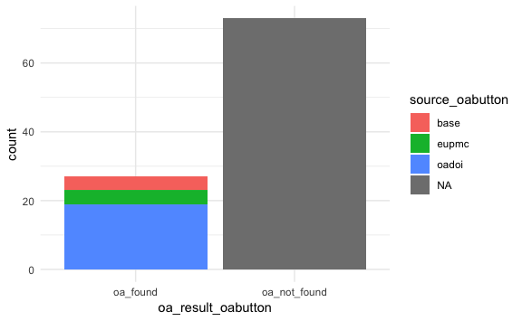
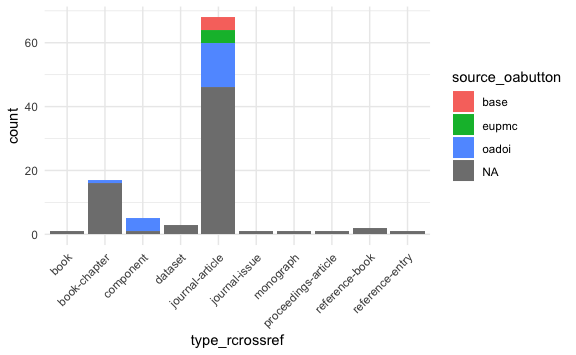

Open Access Button - a Vignette
================
Jessica Minnier
2018-08-27

-   [Introduction and Background](#introduction-and-background)
    -   [Open Access Button](#open-access-button)
    -   [APIs](#apis)
    -   [DOIs](#dois)
    -   [JSON](#json)
-   [Packages](#packages)
-   [OA Button API](#oa-button-api)
-   [Practice](#practice)
-   [Query and Extract Functions](#query-and-extract-functions)
    -   [makePath](#makepath)
    -   [extractAvailability](#extractavailability)
-   [Put it all together](#put-it-all-together)
-   [Summarize results](#summarize-results)

Introduction and Background
===========================

I have been working on a project led by [Robin Champieux](https://github.com/rchampieux) of the OHSU Library that examines the utility of open access search tools such as Unpaywall and Open Access Button in inter-library loan (ILL) queries. I used the APIs from these tools to query a list of articles and determine whether there was an open access version of that article available. Here, I go through a short vignette showing how you can do this yourself.

The Unpaywall API can be queried using the R package [roadoi](https://github.com/ropensci/roadoi). As far as I know, the open access button does not yet have a package that can query it the same way. So, let's try using API tools in R.

Note: you must have internet access for this to run.

Open Access Button
------------------

The [Open Access (OA) Button](https://openaccessbutton.org/) can be installed as an extension to your web browser so that when you are on a website for an article, the the button alerts you to an open access version of that article that you can view without an expensive subscription to publisher and academic journal content. Tools like OA button and Unpaywall are making headway in making science results accessible to all.

APIs
----

API is an acronym for application programming interface. We can use APIs to gather a large amount of information based on queries sent to a database that is hosted in a particular website. It's like sending a question to a website and getting an answer back in a standardized format. A good introduction to API can be found on [Zapier](https://zapier.com/learn/apis/).

I used this [helpful blog post](http://tophcito.blogspot.com/2015/11/accessing-apis-from-r-and-little-r.html) by Christoph Waldhauser to get me started in querying APIs using R. Much of the code in this vignette can be found in that blog post.

DOIs
----

I will be using DOIs (digital object identifiers) to query articles, as well as article titles. DOIs are useful because they are unique and standardized ways of identifying scholarly articles, books, software, photographs, and other objects. The ROpenSci R package [`rcrossref`](https://github.com/ropensci/rcrossref) is a great way to explore articles using the Crossref metadata search API. We will be using this package to generate and query DOIs for articles.

JSON
----

JSON is a data format...

Packages
========

We will use the R packages `urltools`, `httr`, `jsonlite` to query the API and process the JSON data that is returned from the API. We will also use ROpenSci's package [`rcrossref`](https://github.com/ropensci/rcrossref) to generate some DOIs and look up some information about articles.

``` r
# install.packages(c("urltools","httr","jsonlite","rcrossref"))
library(urltools)
library(httr)
library(jsonlite)
library(rcrossref)
```

OA Button API
=============

Take a look at the website for [OA button API](https://openaccessbutton.org/api), and familiarize yourself with the possible types of queries. We will be using the `GET` query to search `availibility`.

Note that OA Button wants you to use an apikey. You should generate yoru own apikey and use it for queries. As of now, this is not enforced, so we can still run queries without one, but it's good practice to use a key so that you can be identified.

Practice
========

Let's try a blank query to the API:

``` r
oa_url  <- "https://api.openaccessbutton.org" # url of the API
path <- "/" # blank path for testing

# A blank query. Get the result in JSON
raw_result <- GET(url = oa_url, path = path)
raw_result #JSON output
```

    #> Response [https://api.openaccessbutton.org/]
    #>   Date: 2018-08-28 03:14
    #>   Status: 200
    #>   Content-Type: application/json; charset=utf-8
    #>   Size: 43 B
    #> {
    #>   "data": "The Open Access Button API."

This just lets us know we've reached the right URL (<https://api.openaccessbutton.org/>). Now what if we try a hello world? There's an article with "Hello World" in the title that happens to be open access (thanks NIH!) and we can see the citation using `rcrossref::cr_cn`:

``` r
rcrossref::cr_cn(dois="10.1007/s10278-018-0079-6",format="text",style="apa")
```

    #> [1] "Lakhani, P., Gray, D. L., Pett, C. R., Nagy, P., & Shih, G. (2018). Hello World Deep Learning in Medical Imaging. Journal of Digital Imaging, 31(3), 283–289. doi:10.1007/s10278-018-0079-6"

Now let's query the OA button API with the article's doi:

``` r
path <- "/availability?url=10.1007/s10278-018-0079-6" # url path

# A blank query. Get the result in JSON
raw_result <- GET(url = oa_url, path = path)
raw_result #JSON output
```

    #> Response [https://api.openaccessbutton.org/availability?url=10.1007/s10278-018-0079-6]
    #>   Date: 2018-08-28 03:14
    #>   Status: 200
    #>   Content-Type: application/json; charset=utf-8
    #>   Size: 607 B
    #> {
    #>   "data": {
    #>     "match": "https://doi.org/10.1007/s10278-018-0079-6",
    #>     "availability": [
    #>       {
    #>         "type": "article",
    #>         "url": "http://europepmc.org/backend/ptpmcrender.fcgi?accid=PMC5...
    #>       }
    #>     ],
    #>     "requests": [],
    #> ...

What's going on here? We are using the `httr::GET` function to obtain the result from the API with a certain url. The url we are querying is <https://api.openaccessbutton.org/availability?url=10.1007/s10278-018-0079-6>. We construct this url by adding the path "/availability?url=10.1007/s10278-018-0079-6" to the API url "<https://api.openaccessbutton.org>". If we click on this link <https://api.openaccessbutton.org/availability?url=10.1007/s10278-018-0079-6>, our browser will show us the JSON output.

So, is this article available via open access, or not? It looks like there's something in the "availibility" field, but it's hard to see the data when it's in this not-quite-readable JSON format. Let's clean it up a bit. The output of `GET` is an object of type "raw" but JSON is by nature a string, so we will use `rawToChar` function to turn it into a character string. Then, `jsonlite::fromJSON` will process the JSON string into a list of lists.

``` r
str(raw_result$content)
```

    #>  raw [1:607] 7b 0a 20 20 ...

``` r
this_raw_content <- rawToChar(raw_result$content)
str(this_raw_content)
```

    #>  chr "{\n  \"data\": {\n    \"match\": \"https://doi.org/10.1007/s10278-018-0079-6\",\n    \"availability\": [\n     "| __truncated__

What does `fromJSON` give us?

``` r
this_content <- jsonlite::fromJSON(this_raw_content)
str(this_content)
```

    #> List of 1
    #>  $ data:List of 5
    #>   ..$ match       : chr "https://doi.org/10.1007/s10278-018-0079-6"
    #>   ..$ availability:'data.frame': 1 obs. of  2 variables:
    #>   .. ..$ type: chr "article"
    #>   .. ..$ url : chr "http://europepmc.org/backend/ptpmcrender.fcgi?accid=PMC5959832&blobtype=pdf"
    #>   ..$ requests    : list()
    #>   ..$ accepts     : list()
    #>   ..$ meta        :List of 4
    #>   .. ..$ article:List of 3
    #>   .. .. ..$ redirect: chr "http://europepmc.org/backend/ptpmcrender.fcgi?accid=PMC5959832&blobtype=pdf"
    #>   .. .. ..$ url     : chr "http://europepmc.org/backend/ptpmcrender.fcgi?accid=PMC5959832&blobtype=pdf"
    #>   .. .. ..$ source  : chr "eupmc"
    #>   .. ..$ data   : Named list()
    #>   .. ..$ cache  : logi TRUE
    #>   .. ..$ refresh: int 30

`this_content` is a list, with one element called `data`, which is also a list. We can extract the data frame from showing availibility:

``` r
this_content$data$availability
```

| type    | url                                                                           |
|:--------|:------------------------------------------------------------------------------|
| article | <http://europepmc.org/backend/ptpmcrender.fcgi?accid=PMC5959832&blobtype=pdf> |

If we click on this link <http://europepmc.org/backend/ptpmcrender.fcgi?accid=PMC5959832&blobtype=pdf> we can see the article as a pdf, freely available for all to read!

Query and Extract Functions
===========================

All of this pasting together urls and DOIs and processing strings is a bit cumbersome and will easily become repetitive when we query a list of articles. We can write some functions that use our query as an input (i.e. a DOI or an article title) and outputs the availibility data frame.

makePath
--------

This function takes our query as an input and outputs the URL we use in `GET`. Since we may want to query a title which may have spaces, we use `urltools::url_encode` to convert the title into a URL friendly string.

We add the parameter `queryname` since some searches can be improved by specifying which type of query we are using, such as "doi" or "title", though the default "url" works well in most cases.

We leave an option to add your `apikey` if you have it.

Not familiar with `glue::glue`? Check out the [readme](https://github.com/tidyverse/glue) on github.

``` r
makePath <- function(query, 
                      path="availability",
                      queryname="url", # can be more specific such as "doi" or "title"
                      apikey = NULL) {
  query <- urltools::url_encode(query)
  pathout <- glue::glue("{path}?{queryname}={query}")
  if(!is.null(apikey)) {pathout <- glue::glue("{pathout}&apikey={apikey}")} # use an apikey if we have it
  return(pathout)
}
```

``` r
(my_path <- makePath(query="10.1007/s10278-018-0079-6"))
```

    #> availability?url=10.1007%2fs10278-018-0079-6

``` r
GET(url=oa_url,path=my_path)
```

    #> Response [https://api.openaccessbutton.org/availability?url=10.1007%2fs10278-018-0079-6]
    #>   Date: 2018-08-28 03:14
    #>   Status: 200
    #>   Content-Type: application/json; charset=utf-8
    #>   Size: 607 B
    #> {
    #>   "data": {
    #>     "match": "https://doi.org/10.1007/s10278-018-0079-6",
    #>     "availability": [
    #>       {
    #>         "type": "article",
    #>         "url": "http://europepmc.org/backend/ptpmcrender.fcgi?accid=PMC5...
    #>       }
    #>     ],
    #>     "requests": [],
    #> ...

This function also works on a vector, which will become handy later. See the examples:

``` r
makePath(query=letters[1:3]) # vectorize!
```

    #> availability?url=a
    #> availability?url=b
    #> availability?url=c

``` r
data_frame(doi=letters[1:3]) %>% mutate(path = makePath(doi)) # works in the tidyverse
```

| doi | path               |
|:----|:-------------------|
| a   | availability?url=a |
| b   | availability?url=b |
| c   | availability?url=c |

extractAvailability
-------------------

We need a function to extract the availability data frame from the JSON results, as well as some other useful information such as title, if available. The problem is, the JSON results don't always have an availability field, so we can't use extract type functions. For example,

This function takes the output from `fromJSON` and extracts the availability data frame.

``` r
extractAvailability = function(rawcontent) {
  # Test whether there is anything in the availability field
  if(length(rawcontent$data$availability)>0){
    bind_cols(data_frame(match=rawcontent$data$match),
              as_data_frame(rawcontent$data$availability),
              data_frame(
                source=rawcontent$data$meta$article$source,
                title=ifelse(length(rawcontent$data$meta$article$title)>0,rawcontent$data$meta$article$title,NA) # not always available
                ))
  }else{
    bind_cols(data_frame(match=rawcontent$data$match),url=NA)
  }
}
extractAvailability(this_content)
```

| match                                       | type    | url                                                                           | source | title |
|:--------------------------------------------|:--------|:------------------------------------------------------------------------------|:-------|:------|
| <https://doi.org/10.1007/s10278-018-0079-6> | article | <http://europepmc.org/backend/ptpmcrender.fcgi?accid=PMC5959832&blobtype=pdf> | eupmc  | NA    |

We can try using this function on a few different DOIs. Note I've converted the above example code to tidyverse style of coding:

``` r
# OA not available
tmpquery = "10.1234/567890"
tmpraw = GET(url=oa_url,path=makePath(tmpquery))
tmpraw %>% 
  magrittr::extract2("content") %>% 
  rawToChar() %>% 
  fromJSON() %>%
  extractAvailability()
```

| match                            | url |
|:---------------------------------|:----|
| <https://doi.org/10.1234/567890> | NA  |

``` r
# OA available
tmpquery = "10.1007/s10278-018-0079-6"
tmpraw = GET(url=oa_url,path=makePath(tmpquery))
tmpraw %>% 
  magrittr::extract2("content") %>% 
  rawToChar() %>% 
  fromJSON() %>%
  extractAvailability()
```

| match                                       | type    | url                                                                           | source | title |
|:--------------------------------------------|:--------|:------------------------------------------------------------------------------|:-------|:------|
| <https://doi.org/10.1007/s10278-018-0079-6> | article | <http://europepmc.org/backend/ptpmcrender.fcgi?accid=PMC5959832&blobtype=pdf> | eupmc  | NA    |

``` r
# OA available, with title search
tmpquery = "Hello World"
tmpraw = GET(url=oa_url,path=makePath(tmpquery))
tmpraw %>% 
  magrittr::extract2("content") %>% 
  rawToChar() %>% 
  fromJSON() %>%
  extractAvailability()
```

| match       | type    | url                                                                           | source | title |
|:------------|:--------|:------------------------------------------------------------------------------|:-------|:------|
| Hello World | article | <http://europepmc.org/backend/ptpmcrender.fcgi?accid=PMC5959832&blobtype=pdf> | eupmc  | NA    |

``` r
# OA available, with url search; title available
tmpquery = "https://doi.org/10.1017/S0033291711000997"
tmpraw = GET(url=oa_url,path=makePath(tmpquery))
tmpraw %>% 
  magrittr::extract2("content") %>% 
  rawToChar() %>% 
  fromJSON() %>%
  extractAvailability()
```

| match                                       | type    | url                                                                           | source | title |
|:--------------------------------------------|:--------|:------------------------------------------------------------------------------|:-------|:------|
| <https://doi.org/10.1017/S0033291711000997> | article | <http://europepmc.org/backend/ptpmcrender.fcgi?accid=PMC3837420&blobtype=pdf> | eupmc  | NA    |

Put it all together
===================

Ok, now let's use our functions to grab some data! We'll use `rcrossref` to generate some random dois:

``` r
set.seed(100)
doi_sample <- data_frame(query = rcrossref::cr_r(sample = 100))
head(doi_sample)
```

| query                              |
|:-----------------------------------|
| 10.1007/bf00656700                 |
| 10.1016/b978-0-444-51343-4.50100-9 |
| 10.1016/j.cardfail.2010.06.358     |
| 10.3917/cpsy.051.0191              |
| 10.1007/s10453-010-9165-z          |
| 10.22452/jummec.vol20no2.3         |

Let's construct our queries:

``` r
doi_sample <- doi_sample %>% 
  mutate(path = makePath(query))
doi_sample
```

| query                                             | path                                                                     |
|:--------------------------------------------------|:-------------------------------------------------------------------------|
| 10.1007/bf00656700                                | availability?url=10.1007%2fbf00656700                                    |
| 10.1016/b978-0-444-51343-4.50100-9                | availability?url=10.1016%2fb978-0-444-51343-4.50100-9                    |
| 10.1016/j.cardfail.2010.06.358                    | availability?url=10.1016%2fj.cardfail.2010.06.358                        |
| 10.3917/cpsy.051.0191                             | availability?url=10.3917%2fcpsy.051.0191                                 |
| 10.1007/s10453-010-9165-z                         | availability?url=10.1007%2fs10453-010-9165-z                             |
| 10.22452/jummec.vol20no2.3                        | availability?url=10.22452%2fjummec.vol20no2.3                            |
| 10.1556/oh.2010.28976                             | availability?url=10.1556%2foh.2010.28976                                 |
| 10.1007/978-3-319-67193-2\_4                      | availability?url=10.1007%2f978-3-319-67193-2\_4                          |
| 10.1121/1.427464                                  | availability?url=10.1121%2f1.427464                                      |
| 10.1371/journal.pone.0044037.s001                 | availability?url=10.1371%2fjournal.pone.0044037.s001                     |
| 10.2210/pdb3uza/pdb                               | availability?url=10.2210%2fpdb3uza%2fpdb                                 |
| 10.4011/shikizai1937.73.403                       | availability?url=10.4011%2fshikizai1937.73.403                           |
| 10.1093/acprof:oso/9780199653645.003.0002         | availability?url=10.1093%2facprof%3aoso%2f9780199653645.003.0002         |
| 10.3775/jie.35.8\_484b                            | availability?url=10.3775%2fjie.35.8\_484b                                |
| 10.1007/s11468-015-9920-7                         | availability?url=10.1007%2fs11468-015-9920-7                             |
| 10.1093/acprof:oso/9780195304381.003.0009         | availability?url=10.1093%2facprof%3aoso%2f9780195304381.003.0009         |
| 10.1007/978-94-011-3098-1\_11                     | availability?url=10.1007%2f978-94-011-3098-1\_11                         |
| 10.1163/9789004206106\_eifo\_dum\_0335            | availability?url=10.1163%2f9789004206106\_eifo\_dum\_0335                |
| 10.13182/nt-13-28                                 | availability?url=10.13182%2fnt-13-28                                     |
| 10.1007/bf00755740                                | availability?url=10.1007%2fbf00755740                                    |
| 10.1093/ajcp/30.2.148                             | availability?url=10.1093%2fajcp%2f30.2.148                               |
| 10.1109/30.883429                                 | availability?url=10.1109%2f30.883429                                     |
| 10.1007/978-3-642-41714-6\_21680                  | availability?url=10.1007%2f978-3-642-41714-6\_21680                      |
| 10.5772/17401                                     | availability?url=10.5772%2f17401                                         |
| 10.7788/boehlau.9783412214395.fm                  | availability?url=10.7788%2fboehlau.9783412214395.fm                      |
| 10.2307/4351506                                   | availability?url=10.2307%2f4351506                                       |
| 10.1007/bf02148331                                | availability?url=10.1007%2fbf02148331                                    |
| 10.1007/978-3-642-73005-4\_18                     | availability?url=10.1007%2f978-3-642-73005-4\_18                         |
| 10.1093/ptj/20.4.249                              | availability?url=10.1093%2fptj%2f20.4.249                                |
| 10.2307/3285436                                   | availability?url=10.2307%2f3285436                                       |
| 10.2307/2289315                                   | availability?url=10.2307%2f2289315                                       |
| 10.1007/978-3-642-32964-7\_29                     | availability?url=10.1007%2f978-3-642-32964-7\_29                         |
| 10.1016/j.jogn.2017.04.109                        | availability?url=10.1016%2fj.jogn.2017.04.109                            |
| 10.5935/1984-6835.20150142                        | availability?url=10.5935%2f1984-6835.20150142                            |
| 10.1007/978-981-10-6502-6\_38                     | availability?url=10.1007%2f978-981-10-6502-6\_38                         |
| 10.1007/springerreference\_88693                  | availability?url=10.1007%2fspringerreference\_88693                      |
| 10.1016/s0924-977x(03)92352-2                     | availability?url=10.1016%2fs0924-977x%2803%2992352-2                     |
| 10.1002/maco.19740250303                          | availability?url=10.1002%2fmaco.19740250303                              |
| 10.1093/mnras/236.4.929                           | availability?url=10.1093%2fmnras%2f236.4.929                             |
| 10.1126/science.321.5887.356                      | availability?url=10.1126%2fscience.321.5887.356                          |
| 10.1524/zpch.1998.1.1.269                         | availability?url=10.1524%2fzpch.1998.1.1.269                             |
| 10.1016/s1567-5688(06)81802-7                     | availability?url=10.1016%2fs1567-5688%2806%2981802-7                     |
| 10.1016/j.jmig.2015.10.006                        | availability?url=10.1016%2fj.jmig.2015.10.006                            |
| 10.1002/chin.197229085                            | availability?url=10.1002%2fchin.197229085                                |
| 10.1017/s0370164600006544                         | availability?url=10.1017%2fs0370164600006544                             |
| 10.1080/1367467042000208172                       | availability?url=10.1080%2f1367467042000208172                           |
| 10.1037/13900-005                                 | availability?url=10.1037%2f13900-005                                     |
| 10.4314/ajcr.v8i3.39432                           | availability?url=10.4314%2fajcr.v8i3.39432                               |
| 10.1002/bjs.10253                                 | availability?url=10.1002%2fbjs.10253                                     |
| 10.1017/cbo9780511491115                          | availability?url=10.1017%2fcbo9780511491115                              |
| 10.1111/ajr.1999.7.issue-2                        | availability?url=10.1111%2fajr.1999.7.issue-2                            |
| 10.4067/s0718-34372014000200011                   | availability?url=10.4067%2fs0718-34372014000200011                       |
| 10.1511/2006.58.3482                              | availability?url=10.1511%2f2006.58.3482                                  |
| 10.1017/s0021900200004101                         | availability?url=10.1017%2fs0021900200004101                             |
| 10.2307/2179729                                   | availability?url=10.2307%2f2179729                                       |
| 10.2165/00128415-199505750-00027                  | availability?url=10.2165%2f00128415-199505750-00027                      |
| 10.4159/9780674735521-023                         | availability?url=10.4159%2f9780674735521-023                             |
| 10.1016/0022-0248(91)90828-s                      | availability?url=10.1016%2f0022-0248%2891%2990828-s                      |
| 10.1186/1756-9966-28-27                           | availability?url=10.1186%2f1756-9966-28-27                               |
| 10.1016/0926-9959(95)96374-h                      | availability?url=10.1016%2f0926-9959%2895%2996374-h                      |
| 10.1023/a:1021322228428                           | availability?url=10.1023%2fa%3a1021322228428                             |
| 10.1016/b978-012374473-9.00297-6                  | availability?url=10.1016%2fb978-012374473-9.00297-6                      |
| 10.1080/09540962.2012.691305                      | availability?url=10.1080%2f09540962.2012.691305                          |
| 10.1093/benz/9780199773787.article.b00120577      | availability?url=10.1093%2fbenz%2f9780199773787.article.b00120577        |
| 10.1111/j.1469-8749.1975.tb03537.x                | availability?url=10.1111%2fj.1469-8749.1975.tb03537.x                    |
| 10.1016/j.ejrex.2004.03.003                       | availability?url=10.1016%2fj.ejrex.2004.03.003                           |
| 10.1126/science.87.2262.413                       | availability?url=10.1126%2fscience.87.2262.413                           |
| 10.1163/9789004297784\_007                        | availability?url=10.1163%2f9789004297784\_007                            |
| 10.2307/3510308                                   | availability?url=10.2307%2f3510308                                       |
| 10.2307/4049200                                   | availability?url=10.2307%2f4049200                                       |
| 10.1155/2014/695471                               | availability?url=10.1155%2f2014%2f695471                                 |
| 10.1094/phyto.2002.92.4.400                       | availability?url=10.1094%2fphyto.2002.92.4.400                           |
| 10.4324/9781351248877                             | availability?url=10.4324%2f9781351248877                                 |
| 10.1016/j.ssi.2016.06.016                         | availability?url=10.1016%2fj.ssi.2016.06.016                             |
| 10.1295/polymj.6.424                              | availability?url=10.1295%2fpolymj.6.424                                  |
| 10.1002/chem.201504532                            | availability?url=10.1002%2fchem.201504532                                |
| 10.1109/splc.2008.15                              | availability?url=10.1109%2fsplc.2008.15                                  |
| 10.1007/s11458-010-0220-7                         | availability?url=10.1007%2fs11458-010-0220-7                             |
| 10.1021/ja00228a041                               | availability?url=10.1021%2fja00228a041                                   |
| 10.1108/eb032889                                  | availability?url=10.1108%2feb032889                                      |
| 10.1007/bf02339788                                | availability?url=10.1007%2fbf02339788                                    |
| 10.1093/gmo/9781561592630.article.j014400         | availability?url=10.1093%2fgmo%2f9781561592630.article.j014400           |
| 10.1016/s0166-3542(07)00271-9                     | availability?url=10.1016%2fs0166-3542%2807%2900271-9                     |
| 10.1371/journal.pone.0112818.g005                 | availability?url=10.1371%2fjournal.pone.0112818.g005                     |
| 10.1039/c7cp02000g                                | availability?url=10.1039%2fc7cp02000g                                    |
| 10.1007/978-3-540-45677-3\_4                      | availability?url=10.1007%2f978-3-540-45677-3\_4                          |
| 10.1007/bf03025915                                | availability?url=10.1007%2fbf03025915                                    |
| 10.1002/chin.199415258                            | availability?url=10.1002%2fchin.199415258                                |
| 10.1371/journal.pone.0041423.s006                 | availability?url=10.1371%2fjournal.pone.0041423.s006                     |
| 10.3410/f.718541844.793499498                     | availability?url=10.3410%2ff.718541844.793499498                         |
| 10.1130/0091-7613(2001)029&lt;0566:&gt;2.0.co;2   | availability?url=10.1130%2f0091-7613%282001%29029%3c0566%3a%3e2.0.co%3b2 |
| 10.1016/s0002-8703(43)90308-4                     | availability?url=10.1016%2fs0002-8703%2843%2990308-4                     |
| 10.12968/gasn.2010.8.5.48573                      | availability?url=10.12968%2fgasn.2010.8.5.48573                          |
| 10.1371/journal.pone.0168235.t002                 | availability?url=10.1371%2fjournal.pone.0168235.t002                     |
| 10.1017/cbo9780511667558.002                      | availability?url=10.1017%2fcbo9780511667558.002                          |
| 10.3862/jcoloproctology.67.68                     | availability?url=10.3862%2fjcoloproctology.67.68                         |
| 10.1628/093245613x666243                          | availability?url=10.1628%2f093245613x666243                              |
| 10.2307/3406257                                   | availability?url=10.2307%2f3406257                                       |
| 10.2305/iucn.uk.2012-1.rlts.t22705228a39382310.en | availability?url=10.2305%2fiucn.uk.2012-1.rlts.t22705228a39382310.en     |
| 10.1134/s0006297911110113                         | availability?url=10.1134%2fs0006297911110113                             |

We don't want to overload the API, so we will add in a second delay to our `GET` function through a loop:

``` r
oabutton_raw <- vector(mode   = "list",
                       length = nrow(doi_sample))
t0 <- Sys.time()
for (i in 1:nrow(doi_sample)) {
  oabutton_raw[[i]] <- GET(url=oa_url,path=doi_sample$path[i]) %>% 
    magrittr::extract2("content") %>% 
    rawToChar() %>% 
    fromJSON()
  message(".", appendLF = FALSE)
  if(i%%50==0) print(i)
  Sys.sleep(time = 1)
}
```

    #> ..................................................

    #> [1] 50

    #> ..................................................

    #> [1] 100

``` r
Sys.time()-t0
```

    #> Time difference of 23.14448 mins

Now let's extract our availability data:

``` r
names(oabutton_raw) <- doi_sample$query
res <- oabutton_raw %>%
  purrr::map_df(extractAvailability,.id="query")
head(res %>% arrange(url))
```

| query                                           | match                                                             | url                                                                                    | type    | source | title                                                                                                    |
|:------------------------------------------------|:------------------------------------------------------------------|:---------------------------------------------------------------------------------------|:--------|:-------|:---------------------------------------------------------------------------------------------------------|
| 10.1016/s0002-8703(43)90308-4                   | <https://doi.org/10.1016/s0002-8703(43)90308-4>                   | <http://europepmc.org/articles/PMC2135367?pdf=render>                                  | article | eupmc  | studies on experimental hypertension. xxi. the purification of renin                                     |
| 10.1186/1756-9966-28-27                         | <https://doi.org/10.1186/1756-9966-28-27>                         | <http://europepmc.org/articles/PMC2650688?pdf=render>                                  | article | eupmc  | Tumor markers of bladder cancer: the schistosomal bladder tumors versus non-schistosomal bladder tumors. |
| 10.1155/2014/695471                             | <https://doi.org/10.1155/2014/695471>                             | <http://europepmc.org/articles/PMC4129146?pdf=render>                                  | article | eupmc  | Spontaneous postmenopausal urethral prolapse treated surgically and successfully.                        |
| 10.1130/0091-7613(2001)029&lt;0566:&gt;2.0.co;2 | <https://doi.org/10.1130/0091-7613(2001)029>&lt;0566:&gt;2.0.co;2 | <http://europepmc.org/articles/PMC6050435?pdf=render>                                  | article | eupmc  | reply                                                                                                    |
| 10.1371/journal.pone.0112818.g005               | <https://doi.org/10.1371/journal.pone.0112818.g005>               | <http://journals.plos.org/plosone/article/figure?id=10.1371/journal.pone.0112818.g005> | article | oadoi  | NA                                                                                                       |
| 10.1371/journal.pone.0168235.t002               | <https://doi.org/10.1371/journal.pone.0168235.t002>               | <http://journals.plos.org/plosone/article/figure?id=10.1371/journal.pone.0168235.t002> | article | oadoi  | NA                                                                                                       |

We can join this to the query table and also search `rcrossref` for metadata.

``` r
res <- left_join(doi_sample,res)

crossref_res <- rcrossref::cr_works(dois = res%>%pull(query)) %>% 
  magrittr::extract2("data")

res_all <- left_join(res, crossref_res, by=c("query"="doi"), suffix = c("_oabutton","_rcrossref"))

# add OA button indicator
res_all     <- res_all%>%mutate(
  oa_result_oabutton = case_when(
    is.na(source_oabutton) ~ "oa_not_found",
    !is.na(source_oabutton) ~ "oa_found")
)
```

A glimpse of the results table is shown below:

``` r
glimpse(res_all)
```

    #> Observations: 100
    #> Variables: 38
    #> $ query              <chr> "10.1007/bf00656700", "10.1016/b978-0-444-5...
    #> $ path               <S3: glue> "availability?url=10.1007%2fbf00656700...
    #> $ match              <chr> "https://doi.org/10.1007/bf00656700", "http...
    #> $ url_oabutton       <chr> NA, NA, NA, NA, NA, "https://jummec.um.edu....
    #> $ type_oabutton      <chr> NA, NA, NA, NA, NA, "article", NA, NA, NA, ...
    #> $ source_oabutton    <chr> NA, NA, NA, NA, NA, "oadoi", NA, NA, NA, "o...
    #> $ title_oabutton     <chr> NA, NA, NA, NA, NA, "EVALUATION OF DIFFUSIO...
    #> $ alternative.id     <chr> "BF00656700", NA, "S107191641000624X", "CPS...
    #> $ container.title    <chr> "Metal Science and Heat Treatment", "Procee...
    #> $ created            <chr> "2004-11-28", "2012-12-04", "2010-08-05", "...
    #> $ deposited          <chr> "2018-07-31", "2017-06-21", "2015-12-28", "...
    #> $ indexed            <chr> "2018-07-31", "2018-05-05", "2018-05-03", "...
    #> $ issn               <chr> "0026-0673,1573-8973", NA, "1071-9164", "22...
    #> $ issue              <chr> "11", NA, "8", "3", "4", "2", "51", NA, "4"...
    #> $ issued             <chr> "1973-11", "2003", "2010-08", "2008", "2010...
    #> $ member             <chr> "297", "78", "78", "2273", "297", "9745", "...
    #> $ page               <chr> "1013-1014", "361-363", "S103", "191", "289...
    #> $ prefix             <chr> "10.1007", "10.1016", "10.1016", "10.3917",...
    #> $ publisher          <chr> "Springer Nature America, Inc", "Elsevier",...
    #> $ reference.count    <chr> "6", "17", "0", "0", "42", "0", "35", "29",...
    #> $ score              <chr> "1", "1", "1", "1", "1", "1", "1", "1", "1"...
    #> $ source_rcrossref   <chr> "Crossref", "Crossref", "Crossref", "Crossr...
    #> $ subject            <chr> "Mechanics of Materials,Condensed Matter Ph...
    #> $ title_rcrossref    <chr> "Relationship between cold working and resi...
    #> $ type_rcrossref     <chr> "journal-article", "book-chapter", "journal...
    #> $ url_rcrossref      <chr> "http://dx.doi.org/10.1007/bf00656700", "ht...
    #> $ volume             <chr> "15", NA, "16", "51", "26", "20", "151", NA...
    #> $ author             <list> [<# A tibble: 2 x 3,   given family     se...
    #> $ link               <list> [<# A tibble: 1 x 4,   URL                ...
    #> $ isbn               <chr> NA, "9780444513434", NA, NA, NA, NA, NA, "9...
    #> $ license            <list> [NULL, NULL, <# A tibble: 1 x 4,   date   ...
    #> $ update.policy      <chr> NA, NA, NA, NA, NA, NA, NA, "http://dx.doi....
    #> $ subtitle           <chr> NA, NA, NA, NA, NA, NA, NA, NA, NA, NA, NA,...
    #> $ assertion          <list> [NULL, NULL, NULL, NULL, NULL, NULL, NULL,...
    #> $ archive            <chr> NA, NA, NA, NA, NA, NA, NA, NA, NA, NA, NA,...
    #> $ abstract           <chr> NA, NA, NA, NA, NA, NA, NA, NA, NA, NA, NA,...
    #> $ funder             <list> [NULL, NULL, NULL, NULL, NULL, NULL, NULL,...
    #> $ oa_result_oabutton <chr> "oa_not_found", "oa_not_found", "oa_not_fou...

Summarize results
=================

Here we can calculate how many DOIs were found to be open access, along with the source that OA button has identified.

``` r
res_all %>% tabyl(oa_result_oabutton)%>%
  adorn_totals()%>%
  adorn_pct_formatting() %>%
  kable()
```

| oa\_result\_oabutton |  n  | percent |
|:--------------------:|:---:|:-------:|
|       oa\_found      |  27 |  27.0%  |
|    oa\_not\_found    |  73 |  73.0%  |
|         Total        | 100 |  100.0% |

``` r
res_all %>% filter(oa_result_oabutton=="oa_found")%>%
  tabyl(source_oabutton)%>%
  adorn_totals()%>%
  adorn_pct_formatting()
```

| source\_oabutton |    n| percent |
|:-----------------|----:|:--------|
| base             |    4| 14.8%   |
| eupmc            |    4| 14.8%   |
| oadoi            |   19| 70.4%   |
| Total            |   27| 100.0%  |

We can visualize that result using bar charts:

``` r
res_all %>% ggplot(aes(x=oa_result_oabutton,fill=source_oabutton)) + 
  geom_bar() + 
  theme_minimal()
```



We can also examine the metadata found with `rscrossref`. For example, here are the various work types found with rcrossref, with colors denoting no open access (grey = NA) or source of open access:

``` r
res_all %>% ggplot(aes(x=type_rcrossref,fill=source_oabutton)) + 
  geom_bar() + 
  theme_minimal() + 
  theme(axis.text.x=element_text(angle=45, hjust = 1))
```


